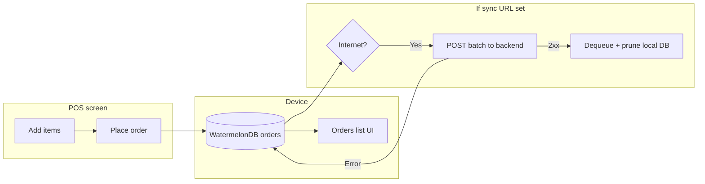
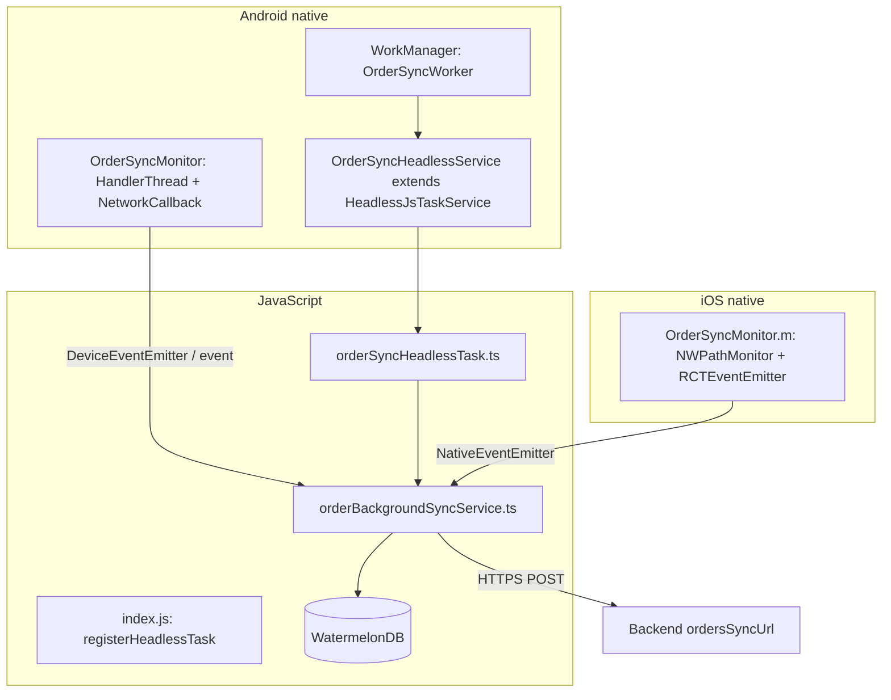

# Orders on device & cloud sync — business and developer guide

This document explains **how orders work in nResto Mobile** from a **business / operations** perspective and from a **developer** perspective: what happens, why it is designed that way, and **how to change** behaviour safely.

---

## Table of contents

1. [Business & product](#1-business--product)
2. [End-to-end order journey](#2-end-to-end-order-journey)
3. [Sync to backend (outbox)](#3-sync-to-backend-outbox)
4. [Developer architecture](#4-developer-architecture)
5. [Configuration reference](#5-configuration-reference)
6. [Backend API contract](#6-backend-api-contract)
7. [How to change behaviour](#7-how-to-change-behaviour)
8. [Local database: orders & aggregates](#8-local-database-orders--aggregates)
9. [Platform differences](#9-platform-differences)
10. [Operations, risks & idempotency](#10-operations-risks--idempotency)
11. [Troubleshooting](#11-troubleshooting)
12. [File index](#12-file-index)

---

## 1. Business & product

### 1.1 What the app does with orders

- Staff use **Point of Sale (POS)** to build a cart and **place orders**.
- Orders are stored **on the device first** (offline-capable) in a local database (**WatermelonDB**).
- The **Orders** screen shows the same data: list, status, payment, totals.
- Optionally, when the business configures a **sync URL**, the app can **upload** pending orders to your **backend** (tracked in **`order_sync_queue`**, not a “sent” column on `orders`). On **HTTP 2xx**, queued work is removed and synced rows are deleted locally **except** the **newest five** orders kept for the Orders screen.

### 1.2 Why offline-first

| Business need | How the app supports it |
|---------------|-------------------------|
| Wi‑Fi or mobile data drops in the venue | Orders still save locally; staff can keep selling. |
| Fast checkout | No mandatory wait for server on every tap. |
| Central reporting / kitchen / ERP | Backend receives batches when the device is online (if sync is enabled). |

### 1.3 What “sync enabled” means for operations

- **Sync disabled** (`ordersSyncUrl` empty): orders **stay on the device** until cleared or managed only inside the app. No automatic upload.
- **Sync enabled**: the app tries to **push** orders that are still **pending** in the outbox queue; on **success**, those uploads are **dequeued** and older local copies are **pruned** (always keeping the **five most recent** orders on device for the UI). Your backend is the **system of record** for what was accepted.

**Important:** Train staff and support: successful sync **does not** wipe all on-device history — the **latest five** orders remain visible locally; full history should come from the **server** if you need it.

### 1.4 What this document does *not* cover

- Menu / master data sync (**GraphQL `getMasterData`**) — see `README.md` and `src/services/masterDataService.ts`.
- Receipt printing — native thermal module.
- Login / auth storage — `src/services/authService.ts`.

---

## 2. End-to-end order journey

### 2.1 High-level flow (business view)



### 2.2 Steps (plain language)

1. User adds items → cart (session state, persisted separately).
2. User confirms order → one row per order in **`orders`** table (items as JSON, totals, status, etc.).
3. **Orders** screen reads from the same table (live updates).
4. If **`ordersSyncUrl`** is configured and the network is available, background logic **POST**s only orders that are **pending** in **`order_sync_queue`**; if the server responds **2xx**, the queue entries are cleared and matching `orders` rows are removed **except** when they fall in the **five newest** kept for the Orders list.

---

## 3. Sync to backend (outbox)

### 3.1 Why “outbox” style

We **do not** delete local orders before the server confirms. That avoids **data loss** if the request fails or times out.

**`order_sync_queue`:** Each row is a **pending upload** for a given `order_id`. There is **no** `sent` / `synced` flag on the `orders` table — presence in the queue means “still need to POST”. Helpers live in `src/database/orderSyncQueueHelpers.ts`; rows are created next to new/updated orders in `AppContext`.

### 3.2 When uploads are attempted (summary)

| Trigger | Purpose |
|---------|---------|
| **After each outbox write** (`order_completed`, `order_updated`, …) | **Required:** if the device stays online and connectivity does not “flip”, uploads would otherwise never run — see `scheduleOrderSync` + `requestOrderUploadNow` from `AppContext` after saving to `orders`. |
| Native connectivity **online** (debounced) | React quickly when network returns while app is running. |
| ~5 s after app start (if online) | Cold start catch-up. |
| App returns to **foreground** | Especially useful on iOS after backgrounding. |
| **Android** WorkManager periodic (~15 min) + one delayed job | When the app process may be dead or backgrounded; uses **Headless JS** to run the same upload code. |

**If `ordersSyncUrl` is empty:** none of the heavy listeners or Android WorkManager jobs are registered — minimal overhead.

### 3.3 Performance choices (why)

- **`fetchCount()` on `order_sync_queue` before `NetInfo` and full `fetch`:** if there are **zero** pending queue rows, the app avoids extra network checks and loading order payloads (saves battery on idle devices and on periodic Android wakes).
- **Native code does not read SQLite:** one implementation in JavaScript + WatermelonDB avoids schema drift and duplicated logic.
- **Debouncing (~3.5 s)** and **minimum interval (~12 s)** between automatic runs reduce duplicate POSTs while the UI stays responsive.

---

## 4. Developer architecture

### 4.1 Layered diagram



### 4.2 What runs where

| Component | Runs on | Responsibility |
|-----------|---------|----------------|
| `OrderSyncMonitor` (Android) | `HandlerThread` | Validated network → emit `OrderSyncMonitorConnectivity`. |
| `OrderSyncMonitor` (iOS) | Serial GCD queue | Path satisfied → emit same event name. |
| `orderBackgroundSyncService` | JS | Debounce, queue `fetchCount`, NetInfo, load queued orders, POST, dequeue + prune `orders` on success (keeps newest N locally). |
| `OrderSyncWorker` | WorkManager thread pool | Start headless service. |
| `OrderSyncHeadlessService` | Android service | Bootstraps RN **without UI** → runs registered headless task. |
| `orderSyncHeadlessTask` | JS (headless context) | Calls `runOrderUploadAndClear(..., { bypassThrottle: true })`. |

### 4.3 Entry points

- **Foreground bootstrap:** `App.tsx` → `OrderSyncBootstrap` → `startOrderBackgroundSync()` (inside `AppProvider`).
- **Headless:** `index.js` registers `OrderSyncHeadless` → `src/orderSyncHeadlessTask.ts`.

---

## 5. Configuration reference

API-related values are merged in **`src/constants/storeConfig.ts`**: **`.env`** (via `react-native-dotenv` at bundle time) plus code defaults (e.g. GraphQL base). You can still override fields at runtime later if you load remote config into the same object.

| Field | Type | Purpose |
|-------|------|---------|
| `ordersSyncUrl` | `string` | **Full URL** for `POST` (e.g. `https://api.example.com/pos/orders/sync`). Populated from **`.env` → `ORDERS_SYNC_URL`** (via `storeConfig`). **Empty = sync pipeline disabled** (no WorkManager, no connectivity listener for sync). |
| `ordersSyncAuthorization` | `string` | Optional `Authorization` for that POST; from **`.env` → `ORDERS_SYNC_AUTHORIZATION`** when set. |
| `graphqlAuthorization` | `string` | From **`.env` → `GRAPHQL_AUTHORIZATION`**. Used as **fallback** `Authorization` if `ordersSyncAuthorization` is empty (including for order sync). |

**Android-only:** `startOrderBackgroundSync()` calls `NativeModules.OrderSyncMonitor.setBackgroundWorkEnabled(true)` when URL is non-empty, which registers WorkManager work; `false` cancels unique work.

---

## 6. Backend API contract

### 6.1 Request

- **Method:** `POST`
- **URL:** `storeConfig.ordersSyncUrl`
- **Headers:** `Content-Type: application/json`, `Accept: application/json`, optional `Authorization`
- **Timeout (client):** 55 seconds (abort via `AbortController`)

### 6.1.1 Curl vs in-app `fetch` (same contract)

The background/foreground sync path is a single `fetch` in `runOrderUploadAndClear` (`orderBackgroundSyncService.ts`): **POST**, JSON body via `JSON.stringify(body)`, same headers as below. A successful `curl` against your backend is a valid smoke test for what the device sends.

**Config:** copy **`.env.example`** → **`.env`** (gitignored) and set **`ORDERS_SYNC_URL`** to the full sync endpoint. Values are injected at build/bundle time via **`react-native-dotenv`** into `storeConfig` (`src/constants/storeConfig.ts`). Leave `ORDERS_SYNC_URL` empty to keep sync disabled. **Restart Metro** after changing `.env` (optionally `--reset-cache`). Metro resolves **`@env`** to **`src/env/index.js`** (stub exports) so the bundler can build the graph; Babel still replaces imports with literals from `.env`. New variable names: Babel **`allowlist`** in `babel.config.js`, **`src/types/env.d.ts`**, and the same keys on **`src/env/index.js`** (stub).

**Local base `http://localhost:4899`:**

| Where the app runs | Host to use in **`ORDERS_SYNC_URL`** / `ordersSyncUrl` |
|--------------------|----------------------------------|
| **iOS Simulator** (Mac) | `http://localhost:4899/orders/sync` (or `127.0.0.1`) |
| **Android Emulator** | `http://10.0.2.2:4899/orders/sync` — `localhost` inside the emulator is the emulator, not your machine |
| **Physical device** | `http://<your-LAN-IP>:4899/orders/sync` (same Wi‑Fi as the server) |

Android debug builds use `android:usesCleartextTraffic="true"`, so **HTTP** to those hosts is allowed.

Example `curl` (equivalent payload shape to the app; omit `Authorization` if unused):

```bash
curl -sS -X POST 'http://localhost:4899/orders/sync' \
  -H 'Accept: application/json' \
  -H 'Content-Type: application/json' \
  -d '{"deviceId":null,"reason":"manual","syncedAt":"2025-03-20T14:32:01.234Z","orders":[]}'
```

When `ordersSyncAuthorization` or `graphqlAuthorization` is set in `storeConfig`, the app adds:

`Authorization: <that string>` — mirror in curl with `-H 'Authorization: Bearer …'` if you test authenticated routes.

### 6.2 JSON body (shape)

```json
{
  "deviceId": "string-or-null",
  "reason": "connectivity | cold_start | manual — **API field is normalized** from internal triggers (`order_completed`, `periodic`, `enable_catchup`, …); see `orderSyncReasonForApi` in `orderBackgroundSyncService.ts`. Logs still show the real `trigger`.",
  "syncedAt": "ISO-8601 string",
  "orders": [
    {
      "localId": "watermelon-id",
      "createdAt": 1730000000000,
      "total": 46.95,
      "paymentMethod": "CASH",
      "orderType": "DINE_IN",
      "tableNumber": null,
      "customerName": null,
      "orderNotes": null,
      "status": "PENDING",
      "createdBy": null,
      "companyId": null,
      "itemsRaw": "[...]",
      "items": [
        { "id": "...", "name": "...", "price": 0, "qty": 1 }
      ]
    }
  ]
}
```

`deviceId` comes from persisted master-data helper (`getOrCreateDeviceId`) when available.

### 6.3 Response

- **Success:** any **2xx** → client **removes** matching **`order_sync_queue`** rows and **deletes** the corresponding **`orders`** rows **unless** they are among the **five newest** by `created_at` (so the Orders screen always retains recent history).
- **Failure:** non-2xx or network error → **queue and orders stay**; retries happen on later triggers.

### 6.4 Idempotency expectation

Foreground and headless (or two devices) could **POST the same `localId`** in edge cases. The server should **deduplicate** or **upsert** by `localId` (or a mapping you return) to avoid double booking in downstream systems.

---

## 7. How to change behaviour

### 7.1 Turn sync on or off

- **On:** set **`ORDERS_SYNC_URL`** in `.env` (or hardcode in `storeConfig` if you fork without dotenv). Restart Metro and rebuild/reload so `startOrderBackgroundSync` sees the new value.
- **Off:** clear **`ORDERS_SYNC_URL`** in `.env` (or leave unset). On next launch, Android WorkManager unique work is **cancelled** and listeners are not attached.

*Future improvement:* load URL from secure storage or remote flags and call a small “reconfigure sync” function that toggles `setAndroidBackgroundWorkEnabled` and re-subscribes — not implemented as a single API today.

### 7.2 Change how often sync runs

| Knob | Location | Notes |
|------|----------|--------|
| Debounce after connectivity | `DEBOUNCE_MS` in `orderBackgroundSyncService.ts` | Default 3500 ms. |
| Min time between auto runs | `MIN_INTERVAL_BETWEEN_RUNS_MS` | Default 12000 ms; bypassed for `manual` and headless (`bypassThrottle`). |
| Android periodic interval | `OrderSyncWorkScheduler.kt` — `PeriodicWorkRequestBuilder(15, TimeUnit.MINUTES)` | **15 minutes is the WorkManager minimum** for periodic work. |
| Delayed job after enable | `scheduleDelayedOnce(..., 120L, ...)` in `OrderSyncMonitorModule.kt` | Seconds after enabling WorkManager. |
| HTTP timeout | `FETCH_TIMEOUT_MS` in `orderBackgroundSyncService.ts` | Default 55 s. |

### 7.3 Change payload or HTTP behaviour

- Edit **`orderRowToJson`** and the `body` object in **`runOrderUploadAndClear`** (`orderBackgroundSyncService.ts`).
- For GraphQL instead of REST, replace `fetch` with your client but keep the same **“delete only on success”** semantics.

### 7.4 Change native Android behaviour

- **Connectivity:** `OrderSyncMonitorModule.kt` (`NetworkCallback`, `maybeEmit` coalescing).
- **Work scheduling:** `OrderSyncWorkScheduler.kt` (`ensurePeriodicScheduled`, `scheduleDelayedOnce`, `cancelAll`).
- **Headless task name:** must match `OrderSyncHeadlessService.TASK_KEY` (`OrderSyncHeadless`) and `AppRegistry.registerHeadlessTask` in `index.js`.

### 7.5 Change iOS behaviour

- **File:** `ios/NRestoMobile/OrderSyncMonitor.m`
- Path monitor runs only when JS subscribes (when sync URL is set). There is **no** periodic headless upload on iOS in this codebase; foreground + AppState drive most catch-up.

### 7.6 Add runtime URL from API

1. Store URL (and token) in KeyValue or secure storage after login.
2. Expose a module that reads it in `ordersSyncUrl()` instead of `storeConfig` only.
3. After updating URL, call `setAndroidBackgroundWorkEnabled(true)` and re-run `startOrderBackgroundSync()` (or split “native enable” into a dedicated `refreshOrderSyncConfig()`).

---

## 8. Local database: orders & aggregates

### 8.1 `orders` table

- Model: `src/database/Order.ts`
- Written when POS completes an order (`AppContext.addCompletedOrder`).
- Read by Orders screen via context subscription.

### 8.1.1 `order_sync_queue` table

- Model: `src/database/OrderSyncQueue.ts`
- One row per order that still needs a successful **POST** to the sync URL. **Not** a boolean column on `orders`.
- After a successful upload, queue rows for those ids are removed; `orders` rows are pruned per **§6.3** (newest five may remain).

### 8.1.2 Constants

- **`KEEP_LAST_ORDERS_LOCAL`** (default `5`) in `orderBackgroundSyncService.ts` — how many newest `orders` rows to retain after a successful sync.

### 8.2 `total_orders` table

- Model: `src/database/TotalOrder.ts`
- Updated by **`syncTotalOrderAggregateFromOrders`** whenever the `orders` collection changes (counts: non-cancelled, paid, unpaid).
- **Orders screen stat cards** derive counts from **in-memory filtered orders**, not from `total_orders`, to avoid stale UI vs list.
- **Useful for:** inspectors, analytics exports, or future server-side alignment — not the primary UI source today.

---

## 9. Platform differences

| Topic | Android | iOS |
|-------|---------|-----|
| Connectivity signal | `ConnectivityManager` + validated cap | `NWPathMonitor` |
| Background upload when UI killed | WorkManager → Headless JS | Not implemented (needs BGProcessing / push / other) |
| Foreground catch-up | Yes + AppState | Yes + AppState |
| WorkManager | Yes | N/A |

---

## 10. Operations, risks & idempotency

- **Data loss risk:** Low for upload path — we only delete after **2xx**. Risk is **server** accepting but failing downstream; handle in your API transactionally.
- **Duplicate POST:** Mitigate with **idempotent** server handling by `localId`.
- **Battery:** With **empty** sync URL, impact is intentionally minimal. With sync on, expect periodic wakes on Android (WorkManager).
- **Compliance:** If orders contain PII, ensure **HTTPS**, token rotation, and server retention policies.

---

## 11. Troubleshooting

| Symptom | Checks |
|---------|--------|
| Orders never leave device | `ordersSyncUrl` set? Device online? Server returns 2xx? Log `[OrderSync]` in dev. |
| Android never runs in background | Was sync enabled at least once after install? WorkManager constraints require **connected** network. Battery optimizations / OEM kills may delay. |
| Duplicate orders on server | Implement idempotency by `localId`. |
| Headless crash on start | Ensure `index.js` registers `OrderSyncHeadless` and task file has no imports that require UI. |

**Dev logging:** search codebase for `[OrderSync]` and `syncTotalOrderAggregateFromOrders`.

### 11.1 Debugging order rows + sync (step-by-step)

1. **Confirm config** — `storeConfig.ordersSyncUrl` must be non-empty (from `.env` → `ORDERS_SYNC_URL`). If empty, dev logs: **`skipped (no ordersSyncUrl …)`**.

2. **Watch Metro / device logs** (filter **`[OrderSync]`**). In **`__DEV__`**, every early exit is logged via **`syncDbg`** in `orderBackgroundSyncService.ts`:
   - **`skipped (no ordersSyncUrl …)`** — URL not configured.
   - **`skipped (sync already in flight)`** — overlapping run.
   - **`skipped (throttle)`** — includes `retryInMs`; use `manual` or `bypassThrottle: true` to force.
   - **`skipped (nothing in order_sync_queue …)`** — nothing pending upload.
   - **`skipped (network not reachable)`** — includes prior `pending` count from `fetchCount`.
   - **`skipped (0 rows after fetch …)`** — rare race between count and fetch.
   - **`POST`** — about to `fetch` (truncated URL, `orderCount`, `reason`).
   - **`uploaded & dequeued (kept newest local history)`** — HTTP 2xx; queue cleared; `orders` pruned (newest five may remain).
   - **`server error`** / **`failed`** — non-2xx or exception; rows stay in DB.

3. **Production** — `syncDbg` and the `POST` / success logs are dev-only (`__DEV__`). **`server error`** / **`failed`** `console.warn` calls are also wrapped in `__DEV__` in `orderBackgroundSyncService.ts`.

4. **Force a sync from JS (debug)** — the same function the pipeline uses is exported:

   ```ts
   import { runOrderUploadAndClear } from './services/orderBackgroundSyncService';
   // e.g. after a dev button or in a one-off scratch file:
   void runOrderUploadAndClear('manual', { bypassThrottle: true });
   ```

   `reason: 'manual'` skips the 12s throttle between automatic runs.

5. **Confirm pending work before upload** — sync uses **`order_sync_queue`**: `database.get<OrderSyncQueue>('order_sync_queue').query().fetchCount()`. Orders screen still reads `orders`. Schema: `src/database/schema.ts`; models: `Order.ts`, `OrderSyncQueue.ts`.

6. **Inspect SQLite (advanced)** — Watermelon uses a SQLite file under the app sandbox. **iOS Simulator:** locate the app container in `~/Library/Developer/CoreSimulator/Devices/<id>/data/...` and open the DB with **DB Browser for SQLite** or `sqlite3`. **Android Emulator:** `adb shell run-as <applicationId> …` (debuggable builds) to copy DB from app files dir. Exact filename may include `watermelon` / default.sqlite per adapter settings.

7. **Android background path** — Foreground registration used to run **only after the splash screen**; it now runs **as soon as `App` mounts** so WorkManager is scheduled earlier. To verify background runs:

   ```bash
   adb logcat -s OrderSyncMonitor:I OrderSyncWorkScheduler:I OrderSyncWorker:I OrderSyncHeadless:I ReactNativeJS:I
   ```

   You should see: `setBackgroundWorkEnabled true` → `enqueueUniquePeriodicWork` / `enqueueUniqueWork delayed` → (after delay) `OrderSyncWorker doWork` → `OrderSyncHeadless start` → `getTaskConfig` → JS `headless JS task invoked` → `[OrderSync] POST` or a `skipped` line.

   If **`start failed (FGS restrictions…)`** appears, Android blocked starting the foreground service from the worker (OEM / version policy); try with the app having been opened once recently, or test on another API level.

   **`ORDERS_SYNC_URL` empty in the built APK** (missing `.env` at bundle time) → no WorkManager and log `listeners not attached (no ordersSyncUrl)`.

---

## 12. File index

| Area | Path |
|------|------|
| Sync logic (JS) | `src/services/orderBackgroundSyncService.ts` |
| Headless entry | `src/orderSyncHeadlessTask.ts` |
| RN registration | `index.js` |
| Native bridge (TS) | `src/native/orderSyncMonitor.ts` |
| Store / URL config | `src/constants/storeConfig.ts` |
| NetInfo helper | `src/services/networkService.ts` |
| App wiring | `App.tsx` (`OrderSyncBootstrap`) |
| Android monitor | `android/.../OrderSyncMonitorModule.kt` |
| Android WorkManager | `android/.../OrderSyncWorkScheduler.kt`, `OrderSyncWorker.kt` |
| Android headless service | `android/.../OrderSyncHeadlessService.kt` |
| Android manifest | `android/app/src/main/AndroidManifest.xml` |
| iOS monitor | `ios/NRestoMobile/OrderSyncMonitor.m` |
| Order model | `src/database/Order.ts` |
| Sync queue model | `src/database/OrderSyncQueue.ts` |
| Enqueue helpers | `src/database/orderSyncQueueHelpers.ts` |
| Aggregate model | `src/database/TotalOrder.ts`, `syncTotalOrderAggregate.ts` |
| Context / orders observe | `src/context/AppContext.tsx` |

---

*Maintainers: keep this doc in sync when changing sync URL handling, WorkManager intervals, or the POST payload shape.*
